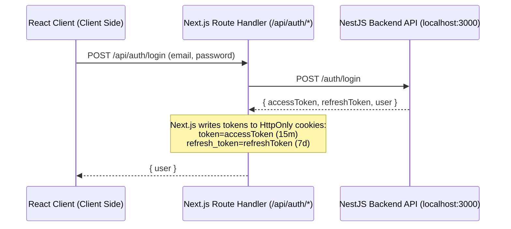

# UI/UX Pro Max Auth Frontend Design Spec

This specification defines the visual aesthetic, layout, accessibility rules, and technical architecture for the Authentication Pages (Login & Register) in the Next.js frontend, based on the UI/UX Pro Max database search recommendations.

## 1. Design System & Aesthetics

### Style Choice: Soft UI Evolution
We will build the forms using a **Soft UI Evolution** style, which relies on clean, high-contrast pastels, soft borders, and smooth shadows to provide subtle depth without low-contrast neumorphism issues.

*   **Shadows**: Custom soft, deep shadows for cards:
    *   `shadow-[0_8px_30px_rgb(0,0,0,0.04)]` or `shadow-sm`
*   **Borders**: Thin slate borders `border-slate-200` to define layout divisions clearly.
*   **Corners**: Generous soft rounded corners: `rounded-2xl` (16px) for cards, `rounded-lg` (8px) for buttons/inputs.

### Color Palette
*   **Page Background**: `#F8FAFC` (slate-50, clean workspace background)
*   **Card/Form Background**: `#FFFFFF` (pure white, high-contrast container)
*   **Primary Brand/CTA**: `#3B82F6` (blue-500, trust-oriented primary)
*   **Hover CTA**: `#2563EB` (blue-600, active feedback)
*   **Primary Text**: `#0F172A` (slate-900)
*   **Secondary/Muted Text**: `#475569` (slate-600)
*   **Error/Alert Text**: `#EF4444` (red-500)

### Typography
*   **Heading Font**: Poppins (configured in Next.js via `next/font/google`)
*   **Body Font**: Open Sans or Inter
*   **Font Weights**: Heading (600/700 Semibold/Bold), Body (400 Regular, 500 Medium)

---

## 2. Page Layout & Component Interaction

### Role Selection Cards
Instead of boring native select dropdowns, we will present role selection (`CLIENT` or `SPECIALIST`) as **interactive Radio Cards** with:
*   A custom icon for each role (e.g. User icon for CLIENT, Calendar/Checklist icon for SPECIALIST).
*   A border/color transition on click (from neutral slate to glowing primary blue).
*   Hover scale micro-interactions (`hover:scale-[1.01] transition-transform duration-200`).

### Accessiblity & Form Best Practices
*   **Explicit Labels**: Every input will have a clear, visible `<label>` element. We will never use placeholders as labels.
*   **Error Fields**: Errors will display immediately on input blur (`mode: "onBlur"` in `react-hook-form`).
*   **Submit Loading State**: Buttons will disable and show a loading spinner during API submission.

---

## 3. Secure Token Storage & Proxy Architecture

Because `httpOnly` cookies cannot be accessed or written by client-side JavaScript (protecting against XSS), the Next.js frontend will use a **Proxy-based Route Handler** to manage tokens.

### Next.js Route Handlers:
1.  `/api/auth/register`: Forwards parameters to NestJS `/auth/register`.
2.  `/api/auth/login`: Forwards to NestJS `/auth/login`, stores tokens in HttpOnly cookies, and returns the User object.
3.  `/api/auth/refresh`: Reads `refresh_token` from HttpOnly cookies, calls NestJS `/auth/refresh`, updates cookies, and returns access token.
4.  `/api/auth/logout`: Clears both cookies.
